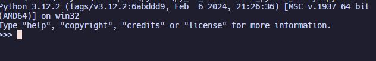
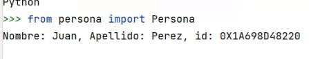

## Uso de REPL y tipo `None` en Python

**Introducción:**

**REPL** significa **Read-Eval-Print Loop** (Bucle de lectura-evaluación-impresión). Es un entorno interactivo que permite ejecutar código Python línea por línea. 

**El tipo `None`** es un valor especial que indica la ausencia de un valor. Se utiliza con frecuencia para representar valores nulos o desconocidos.

**Uso de REPL en Python:**

Para iniciar un REPL de Python, se puede abrir una terminal o un intérprete de Python y escribir:

```
python
```

En el REPL, se puede escribir código Python y presionar Enter para ejecutarlo. El resultado de la evaluación se imprimirá en la siguiente línea.





**Ejemplo:**

```python
>>> 2 + 2
4
>>> nombre = "Juan"
>>> print(nombre)
Juan
```

**El tipo `None` en Python:**

El tipo `None` se puede utilizar para asignar un valor nulo a una variable.

**Ejemplo:**

```python
>>> variable = None
>>> type(variable)
<class 'NoneType'>
```

**También se puede utilizar `None` como valor por defecto para una función.**

```python
def mi_funcion(valor=None):
    if valor is None:
        print("No se ha pasado ningún valor")
    else:
        print(valor)

>>> mi_funcion()
No se ha pasado ningún valor
>>> mi_funcion("Hola")
Hola
```

**Comprobar si un valor es `None`:**

Se puede utilizar el operador `is` para comprobar si un valor es `None`.

```python
>>> variable is None
True
```

**Uso de `None` en condicionales:**

Se puede utilizar `None` en condicionales para verificar si una variable no tiene un valor asignado.

```python
if variable is None:
    # Se ejecuta este código si la variable no tiene un valor asignado
else:
    # Se ejecuta este código si la variable tiene un valor asignado
```

**Recursos adicionales:**

* Documentación oficial de Python: [se quitó una URL no válida]
* Tutorial de Python: [se quitó una URL no válida]
* Curso de Python para principiantes: [https://www.coursera.org/learn/python-programming](https://www.coursera.org/learn/python-programming)

**Espero que esta información te sea útil. Si tienes alguna pregunta, no dudes en preguntar.**

**Consejos adicionales:**

* El REPL de Python es una herramienta muy útil para aprender el lenguaje y probar código de forma rápida y sencilla.
* El tipo `None` es un valor importante que se puede utilizar en muchas situaciones diferentes.
* Es importante tener en cuenta que `None` no es lo mismo que una cadena vacía (`""`).

**Ejemplo:**

```python
>>> variable = None
>>> variable == ""
False
```

**En este caso, la variable `variable` es `None`, mientras que la cadena vacía (`""`) es un string con longitud 0.**