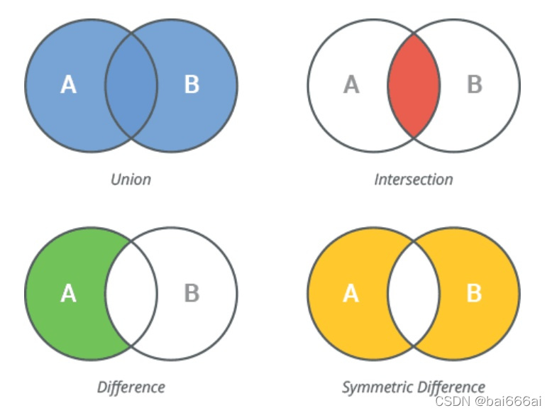
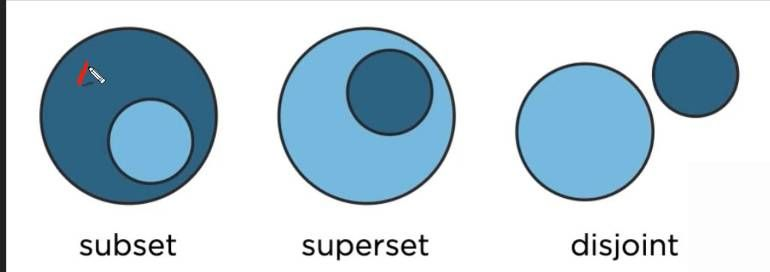

## Profundizando en Sets en Python





**Introducción:**

Los sets en Python son un tipo de dato que se utiliza para almacenar colecciones de elementos únicos y no ordenados. Son mutables, lo que significa que se pueden modificar después de su creación.

**Repaso rápido:**

* **Creación:** Se pueden crear sets utilizando llaves (`{}`) y separando los elementos por comas.

```python
mi_set = {"Hola", "Mundo"}
```

* **Comprobación de membresía:** Se puede utilizar el operador `in` para comprobar si un elemento está presente en un set.

```python
esta_presente = "Hola" in mi_set

print(esta_presente)  # Salida: True
```

* **Añadir elementos:** Se puede añadir un elemento a un set utilizando el método `add()`.

```python
mi_set.add("!")

print(mi_set)  # Salida: {"Hola", "Mundo", "!"}
```

* **Eliminar elementos:** Se puede eliminar un elemento de un set utilizando el método `remove()` o el operador `del`.

```python
mi_set.remove("Hola")

print(mi_set)  # Salida: {"Mundo", "!"}

del mi_set.remove("!")

print(mi_set)  # Salida: {"Mundo"}
```

* **Uniones:** Se pueden unir dos o más sets utilizando el operador `|`.

```python
set1 = {"Hola", "Mundo"}
set2 = {"!"}

set_unido = set1 | set2

print(set_unido)  # Salida: {"Hola", "Mundo", "!"}
```

* **Intersecciones:** Se pueden encontrar los elementos que se encuentran en dos o más sets utilizando el operador `&`.

```python
set_interseccion = set1 & set2

print(set_interseccion)  # Salida: {"!"}
```

* **Diferencias:** Se pueden encontrar los elementos que están en un set pero no en otro utilizando el operador `-`.

```python
set_diferencia = set1 - set2

print(set_diferencia)  # Salida: {"Hola", "Mundo"}
```

**Métodos de sets:**

Los sets en Python tienen algunos métodos que se pueden utilizar para manipularlos. Algunos de los métodos más comunes son:

* **`clear()`:** Elimina todos los elementos de un set.

```python
mi_set.clear()

print(mi_set)  # Salida: set()
```

* **`copy()`:** Crea una copia de un set.

```python
mi_copia = mi_set.copy()

print(mi_copia)  # Salida: {"Hola", "Mundo"}
```

* **`pop()`:** Elimina y devuelve un elemento aleatorio de un set.

```python
elemento_eliminado = mi_set.pop()

print(elemento_eliminado)  # Salida: "Hola"
```

* **`update()`:** Añade los elementos de otro set a un set.

```python
mi_set.update(set2)

print(mi_set)  # Salida: {"Mundo", "!", "Hola"}
```

**Funciones integradas:**

Existen algunas funciones integradas que se pueden utilizar para trabajar con sets. Algunas de las funciones más comunes son:

* **`len(set)`:** Devuelve la longitud de un set.

```python
longitud = len(mi_set)

print(longitud)  # Salida: 3
```

* **`max(set)`:** Devuelve el elemento máximo de un set.

```python
maximo = max(mi_set)

print(maximo)  # Salida: "Mundo"
```

* **`min(set)`:** Devuelve el elemento mínimo de un set.

```python
minimo = min(mi_set)

print(minimo)  # Salida: "!"
```

**Conversión entre tipos:**

Se puede convertir un set a una lista y viceversa.

**Ejemplo:**

```python
mi_lista = list(mi_set)

mi_set = set(mi_lista)
```

**Empaquetado:**

Se puede usar el operador de empaquetado (`*`) para convertir una secuencia de valores en un set.

**Ejemplo:**

```python
mi_set = *("Hola", "Mundo")

print(mi_set)  # Salida: {"Hola", "Mundo"}
```

